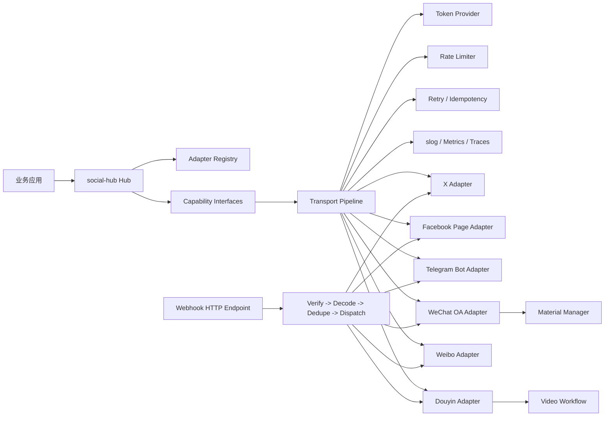
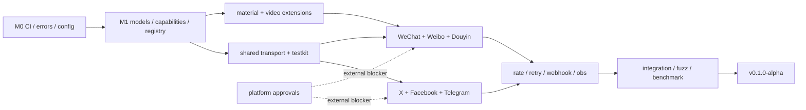

# social-hub：全球社交媒体 Go SDK 调研与实施蓝图

> 基线日期：2026-08-01（Asia/Shanghai）。本文中的版本、授权等级、配额均可能被平台调整；实现时必须把它们作为适配器元数据和运行时策略，而不是散落在业务代码中的常量。

## 0. 范围、术语与结论

- 范围共 18 个平台：海外 11 个，中国大陆 7 个。
- `全量` 表示公开/经标准审核的 API 能覆盖该能力的主流程；`部分` 表示仅限本人、主页、Bot、企业账号、特定内容类型或需专项审批；`不支持` 表示没有合规公开接口，不能用 Cookie、抓包或浏览器自动化冒充 API。
- 很多平台没有单一“最新版本”：微信、微博、抖音等按接口持续演进；LinkedIn 按月版本头；Discord 同时有 REST v10 与 Gateway 版本；Snapchat 按产品线版本。SDK 应记录 `api_product + api_version`，不能只存一个版本字符串。
- Instagram Basic Display API 已于 2024-12-04 下线，新项目应实现 Instagram API（Instagram Login 或 Facebook Login），不能继续以 Basic Display 为目标。
- 中国平台的主要差异不是 JSON 字段，而是准入：主体认证、行业资质、账号类型、内容审核和专项权限往往共同决定能力。SDK 必须先做 capability negotiation，再调用具体操作。

### 0.1 官方资料可信度规则

| 等级 | 使用方式 |
|---|---|
| A | 官方 reference/changelog 明示版本、期限或数字，可作为默认值，但仍解析响应头/控制台配置 |
| B | 官方门户说明“按端点/应用配置”，只记录策略类型，不臆造数字 |
| C | 登录后、白名单或商务合同可见，仅允许账号级配置覆盖；验收必须使用获批沙箱/测试账号 |

---

# 任务一：文档学习报告

## 1. 平台清单、版本、文档与准入

### 1.1 海外平台

| 平台 | 2026-08 API 基线 | 官方文档入口 | 商业授权/企业资质 |
|---|---|---|---|
| Facebook | Graph API v26.0；按版本化 path | [Graph API](https://developers.facebook.com/docs/graph-api/) / [Versioning](https://developers.facebook.com/docs/graph-api/guides/versioning/) | 开发可自测；生产敏感权限需 App Review、Business Verification，部分 Page/WhatsApp 权限另审 |
| X (Twitter) | X API v2 | [X API](https://docs.x.com/x-api) / [rate limits](https://docs.x.com/x-api/fundamentals/rate-limits) | 需 Developer Account；读写量与端点受 Free/Basic/Pro/Enterprise 付费层级限制 |
| Instagram | Instagram API；Graph 版本跟随 Meta v26.0；Basic Display 已下线 | [Instagram Platform](https://developers.facebook.com/docs/instagram-platform/) | 通常限 Professional（Business/Creator）账号；高级权限需 App Review/Business Verification |
| LinkedIn | REST 月度版本，基线 `LinkedIn-Version: 202607`；Talent LTS 另有 202603 | [LinkedIn APIs](https://learn.microsoft.com/en-us/linkedin/) / [versioning](https://learn.microsoft.com/en-us/linkedin/marketing/versioning) | 登录基础权限较易；发帖、组织、Marketing/Talent 多数需产品申请、审核或合作伙伴资质 |
| TikTok | TikTok API v2 / OAuth v2 | [TikTok for Developers](https://developers.tiktok.com/doc/overview/) / [rate limits](https://developers.tiktok.com/doc/tiktok-api-v2-rate-limit/) | Login/Display 可申请；Content Posting、Research、Business 等需审核，Research 不面向商业用户 |
| Telegram | Bot API 10.2（2026-07-14） | [Bot API](https://core.telegram.org/bots/api) / [changelog](https://core.telegram.org/bots/api-changelog) | BotFather 建 Bot 即可；无需企业资质；支付、Business、Stars 等受产品规则约束 |
| Discord | REST API v10；Gateway v10 | [Developer Docs](https://docs.discord.com/developers/intro) | 普通 Bot 可用；达到较大 guild 规模及 privileged intents 需 verification/审批，禁止 self-bot |
| YouTube | YouTube Data API v3 | [Data API v3](https://developers.google.com/youtube/v3) | Google Cloud 项目即可；增配额需审计，未验证项目上传的视频默认 private |
| Pinterest | Pinterest API v5 | [API v5](https://developers.pinterest.com/docs/api/v5/) / [access tiers](https://developers.pinterest.com/docs/key-concepts/access-tiers/) | Trial 可开发；生产建议申请 Standard；广告/商业能力需 business account 和相应权限 |
| Reddit | OAuth Data API（无公共大版本号） | [API](https://www.reddit.com/dev/api/) / [Data API Terms](https://redditinc.com/policies/data-api-terms) | 非商业合规用途须注册；商业、超限研究或条款外用途需单独协议，禁止绕过配额 |
| Snapchat | Marketing/Public Profile API v1；Snap Kit 各产品独立版本 | [Snap for Developers](https://developers.snap.com/) | Marketing API 开放申请；Public Profile API 仍需 allowlist；需 Business Manager 组织管理员 |

> “最新”是本基线下建议 pin 的目标，不代表永久默认。Meta/LinkedIn 必须用自动化兼容矩阵每月检查；LinkedIn 请求版本不能由 SDK 静默漂移。

### 1.2 中国大陆平台

| 平台 | 2026-08 API 基线 | 官方文档入口 | 商业授权/企业资质 |
|---|---|---|---|
| 微信 | 公众平台/开放平台/小程序 API 持续版本，无单一全局版本 | [公众号](https://developers.weixin.qq.com/doc/offiaccount/Getting_Started/Overview.html) / [小程序](https://developers.weixin.qq.com/miniprogram/dev/framework/) / [开放平台](https://developers.weixin.qq.com/doc/oplatform/) | 账号类型决定能力；服务号、高级接口、支付等通常需主体认证，支付还需商户/行业资质 |
| 微博 | Open API v2；新 CLI/商业服务另行计费 | [开放平台](https://open.weibo.com/wiki/API) / [OAuth2](https://open.weibo.com/wiki/Oauth2) | 基础开发可申请；高频、全量数据、商业运营能力需审核、套餐或商务合作 |
| 抖音 | 开放平台 OpenAPI 持续版本；用户 OAuth 2.0，部分 path 为 `/v2/` | [开放平台](https://open.douyin.com/platform/doc) / [OAuth 总览](https://open.douyin.com/platform/resource/docs/develop/permission/overall-permission/) | 应用审核是基础；视频发布、生活服务、直播、电商等常需企业主体、行业/特殊权限及协议 |
| 小红书 | 分享开放平台/商家开放平台按产品持续演进，无统一社区内容 API | [分享开放平台](https://agora.xiaohongshu.com/) / [商家开放平台](https://school.xiaohongshu.com/en/open/index.html) | 分享 SDK 能力有限；商家 API 需店铺/企业；通用社区内容发布、Feed、评论读取没有面向普通开发者的稳定全量 API |
| 快手 | 开放平台 OpenAPI 持续版本 | [快手开放平台](https://open.kuaishou.com/platform/openApi) | 需入驻和应用审核；视频发布 scope、直播/小程序/商业能力可能需专项审核或暂停接入 |
| 哔哩哔哩 | OPEN API 持续版本，无单一全局版本 | [开放平台](https://open.bilibili.com/doc) | 必须身份认证和应用审核；稿件分发、直播、数据等按权限开通，部分能力需创作者授权 |
| 知乎 | Developer API v1（当前以搜索/直答等邀测产品为主） | [知乎开放平台](https://developer.zhihu.com/docs) | 当前邀测；需邮件申请并商务确认，公开文档不等同于开放通用发帖/评论权限 |

## 2. 共性能力抽象与支持矩阵

图例：`全` 全量；`部` 部分/受账号、内容类型或审批限制；`否` 无合规公开能力。这里评价的是“可由第三方 API 合规实现”，不是 App 本身是否有该功能。

| 平台 | 发布 | 用户 | 媒体上传 | Feed/检索 | 点赞/评论 | Webhook/事件 | 消息收发 | 特色扩展 |
|---|:---:|:---:|:---:|:---:|:---:|:---:|:---:|---|
| Facebook | 全 | 全 | 全 | 部 | 全 | 全 | 部 | Page、群组受审、Live、Ads |
| X | 全 | 全 | 全 | 全 | 全 | 部 | 部 | repost/quote、stream |
| Instagram | 全 | 全 | 全 | 部 | 部 | 全 | 部 | carousel、Reels、Stories/Insights 受限 |
| LinkedIn | 全 | 部 | 全 | 部 | 部 | 部 | 否 | organization/UGC、Marketing |
| TikTok | 部 | 全 | 全 | 部 | 部 | 部 | 否 | Direct Post、Research/Business 分产品 |
| Telegram | 全 | 部 | 全 | 部 | 部 | 全 | 全 | Bot commands、Mini Apps、payments/Stars |
| Discord | 全 | 全 | 全 | 部 | 全 | 全 | 全 | guild/channel/thread、Gateway、slash commands |
| YouTube | 全 | 全 | 全 | 全 | 全 | 部 | 部 | playlist、caption、live、analytics |
| Pinterest | 全 | 全 | 全 | 全 | 部 | 部 | 否 | Pin/Board/Catalog/Shopping |
| Reddit | 全 | 全 | 部 | 全 | 全 | 部 | 全 | subreddit、crosspost、moderation |
| Snapchat | 部 | 部 | 部 | 部 | 部 | 部 | 部 | Lens、Public Profile、Ads；多项 allowlist |
| 微信 | 部 | 部 | 全 | 否 | 部 | 全 | 全 | 临时/永久素材、客服/订阅消息、小程序 |
| 微博 | 全 | 全 | 全 | 全 | 全 | 部 | 部 | 转发为独立传播实体、话题/热搜 |
| 抖音 | 部 | 全 | 全 | 部 | 部 | 全 | 部 | 分片视频发布、直播/生活服务/电商 |
| 小红书 | 部 | 部 | 部 | 否 | 否 | 部 | 否 | 分享唤起、商家订单/商品；社区 API 受限 |
| 快手 | 部 | 全 | 全 | 部 | 部 | 全 | 部 | 三段式视频上传、直播/小程序/服务号 |
| 哔哩哔哩 | 全 | 全 | 全 | 部 | 部 | 全 | 部 | 稿件/专栏、弹幕、直播长连 |
| 知乎 | 否 | 否 | 否 | 部 | 否 | 否 | 否 | 搜索、热榜、直答（邀测） |

### 2.1 建议抽象的 8 项核心能力

| 能力 | 最小契约 | 中国/海外差异与设计决定 |
|---|---|---|
| Publish | 创建/查询发布状态/删除 | 海外多为单请求或 media container；微信是草稿/群发或消息，小红书不应伪装为通用发布；短视频平台必须建 upload session |
| Identity | 当前账号、按 ID 获取公开资料 | 微信 `openid` 是 app-scoped、`unionid` 有条件出现；抖音/快手也用 app-scoped open ID，不能跨应用当全局用户 ID |
| Media | 初始化、分片上传、完成、处理状态 | 微信区分临时/永久素材；Meta/TikTok/快手/YouTube 有异步处理；统一成状态机而非一个 `Upload([]byte)` |
| Fetch | 按 ID、分页列表、搜索 | 中国平台通常不开放 home timeline；SDK 应拆 `ListOwnPosts` 与 `SearchPublic`，不得以一个 Feed 承诺过度能力 |
| React | 点赞、取消、评论、回复、转发 | 微博 repost 是带原微博引用的独立实体；Reddit vote 不等于公开点赞；Telegram reaction 绑定 chat/message |
| Webhook | 验证、验签、解析、幂等 | 微信 GET 握手 + SHA1、XML/JSON；Meta challenge + signature；Telegram secret header；Discord interaction signature |
| Message | 发送、回复、会话/收件事件 | Telegram/Discord 是主能力；微信客服消息受会话窗口、订阅消息模板限制；多数内容平台无任意私信 API |
| Insights | 指标快照、时间范围、维度 | 定义为可选扩展；各平台统计口径、延迟和权限差异大，禁止把不同口径直接相加 |

## 3. 认证方式与 Token 生命周期

| 平台 | 认证流程 | 刷新/失效策略 |
|---|---|---|
| Facebook / Instagram | OAuth 2.0 Authorization Code；app/page/system-user token 按产品区分 | 短期 user token 可换 long-lived；Page token 由 user token 派生；失效原因多，必须 debug/重新授权 |
| X | OAuth 2.0 Authorization Code + PKCE；OAuth 1.0a 仍用于部分 user-context 场景；app-only Bearer | OAuth2 可返回 refresh token（需 `offline.access`）；1.0a token 通常长期但可撤销 |
| LinkedIn | OAuth 2.0 3-legged；部分产品 2-legged | access token 常见 60 天；refresh token 只向获批项目开放，未获批需重新授权 |
| TikTok | OAuth 2.0 v2 Authorization Code，移动/桌面 PKCE | access 24h、refresh 365d；刷新可能轮换 refresh token，必须原子替换 |
| Telegram | Bot token（非 OAuth）；Login Widget/Mini App init data 另验签 | Bot token 无 refresh，泄漏后由 BotFather rotate；Webhook secret 独立管理 |
| Discord | OAuth 2.0、Bot token、interaction Ed25519 signature | Authorization Code 通常有 refresh；Bot token 无 refresh、可 rotate；绝不支持用户 self-bot |
| YouTube | Google OAuth 2.0；公开读可 API key | access 常见 1h；offline consent 得 refresh token；处理 rotation/revocation |
| Pinterest | OAuth 2.0 Authorization Code/部分 Client Credentials | continuous refresh token 60 天，可持续刷新；每次持久化最新 token |
| Reddit | OAuth 2.0（installed/web/script 类型） | `duration=permanent` 可得 refresh token；app-only/client credentials 用于有限场景 |
| Snapchat | OAuth 2.0 Authorization Code | access 约 1h；refresh token 换新 access token |
| 微信公众号 | `appid+secret` 换 app `access_token`，不是用户 OAuth；网页授权另有 OAuth2 | app token 常见 2h，集中缓存、提前刷新、单飞；网页 access token 用 refresh token |
| 微信小程序 | 前端 `wx.login` 得 code，服务端 `code2Session` 换 `openid/session_key/unionid?` | code 一次性；session_key 不作为业务登录态，服务端签发自己的 session/JWT；密钥轮换需兼容窗口 |
| 微博 | OAuth 2.0 Authorization Code；少量旧系统知识仍提 OAuth1，SDK 新实现只走 OAuth2 | 是否返回/允许 refresh 取决于应用等级；以 `expires_in` 为准，无法刷新则重新授权 |
| 抖音 | OAuth 2.0 user token；`client_token` 用于无需用户授权端点 | client token 2h且重复获取会使旧 token 进入短缓冲；user token/refresh 生命周期按产品，国内文档可见最长续期限制 |
| 小红书 | 分享 SDK app 校验；商家 OpenAPI app-key/app-secret 签名/令牌，按产品不同 | 无统一 token 规则；每个 product adapter 单独实现，禁止共享 token provider |
| 快手 | OAuth 2.0 Authorization Code | 文档示例 access 2 天、refresh 180 天；按响应值刷新，可能因权限/账号变化失效 |
| 哔哩哔哩 | 账号授权 + app credential，开放平台服务端鉴权 | 依具体 OpenAPI；以控制台和响应过期时间为准，支持撤销事件 |
| 知乎 | 当前邀测 API 使用 `Authorization: Bearer <access_secret>` + `X-Request-Timestamp` | 静态 secret，无公开 refresh；控制台/商务轮换，按账号隔离 |

**Token 管理硬约束**：`TokenKey = platform + product + tenant + account + subject + scopes`；加密静态存储；刷新使用 distributed singleflight + fencing token；先写新 token 再发布缓存失效事件；日志、error、trace attribute 永不记录 secret/code/session_key。

## 4. 数据模型差异

### 4.1 最小公共字段集

| 实体 | 最小公共字段 | 平台扩展示例 |
|---|---|---|
| User | `ID, Username?, DisplayName?, AvatarURL?, ProfileURL?, AccountType?, Raw` | 微信 `openid/unionid/subscribe`；微博 `verified_type`；Discord `guild_member/roles`；YouTube `channel_id` |
| Post | `ID, AuthorID?, Text?, Media[], CreatedAt?, URL?, ParentID?, Visibility?, Status?, Metrics?, Raw` | 微博 `retweeted_status`；微信图文 `articles[]`；Reddit `subreddit/flair`；X `conversation_id/referenced_tweets` |
| Media | `ID?, Type, URL?, MIME?, Size?, Width?, Height?, Duration?, Status, Checksum?, Raw` | 微信 `media_id` + temporary/permanent + expiry；YouTube processing；TikTok/快手 upload token/fragment |
| Comment | `ID, PostID, AuthorID?, Text, ParentID?, CreatedAt?, Metrics?, Raw` | YouTube `topLevelComment`；Reddit 树深度；微博 reply/reply_comment；弹幕时间轴扩展 |
| Message | `ID, ConversationID, SenderID?, RecipientIDs, Text?, Media[], ReplyToID?, SentAt?, Direction, Raw` | Telegram `chat_id/message_thread_id`；Discord guild/channel；微信 `MsgType/Event` XML 字段 |

公共字段中大量使用 nullable/optional，不用零值猜测“字段不存在”还是“值为 0”。所有模型包含 `Platform`, `AccountID`, `Extensions map[string]json.RawMessage` 或受控 `Raw json.RawMessage`；Raw 默认可关闭，并需数据保留策略。

### 4.2 关键映射冲突

| 冲突 | 处理策略 |
|---|---|
| 微博转发 vs 普通引用 | `Post.Relations[]` 使用 `RelationRepost/Quote/Reply`；保留转发文案和原帖，不把 repost 降格成计数 |
| 微信图文 vs 单帖 | `Post.Blocks[]`/`ArticleItems[]` 表达多篇 article；素材库属于 `MaterialManager`，群发属于 `Broadcaster`，不硬塞进基础 Publisher |
| Reddit comment tree | 公共模型只保留 `ParentID/Depth`，分页和 `more` 节点放扩展；提供可选 tree assembler |
| Telegram/Discord 消息即内容 | 同一原始对象可映射 Message；只有 channel post 语义明确时才映射 Post，避免双写去重失败 |
| 视频异步处理 | Media 状态为 `created/uploading/processing/ready/failed/expired`；发布引用前明确等待条件和 timeout |
| 指标口径差异 | `Metric{Name, Value, AsOf, Window, Dimensions, Definition}`；禁止只提供一个含义模糊的 `Engagement` |
| ID 精度和作用域 | 全部 ID 用 string；附 `IDScope`；不得把 JSON number 解到 `float64` |

## 5. 速率限制策略

| 平台 | 官方规则特征 | SDK 策略 |
|---|---|---|
| Facebook/Instagram | app/user/page/business use-case 多维度；usage headers，部分接口独立配额 | 响应头反馈式 limiter；key 含 app+user/page+use-case；接近阈值主动降速 |
| X | 按 endpoint，通常 15min 或 24h；区分 per-user/per-app；响应含 limit/remaining/reset | 精确 reset-window；endpoint template 归桶；套餐配额作为第二层 budget |
| LinkedIn | 按 application/member/endpoint 日配额，具体值在开发者门户 | 本地日预算 + 429；不硬编码门户私有值；按 UTC/平台 reset 校正 |
| TikTok | 端点独立；常见 v2 user/video 600 次/分钟滑窗 | sliding-window/token bucket；Research/Content Posting 分 product bucket |
| Telegram | 单 chat 约 1 msg/s、group 20/min、免费广播约 30/s；paid broadcast 可至 1000/s | hierarchical limiter：bot→chat→method；解析 `retry_after`；付费开关显式配置 |
| Discord | per-route bucket + global；bucket 由响应头动态返回 | 以 `X-RateLimit-Bucket + major parameters` 建桶；严格尊重 `Retry-After/global` |
| YouTube | quota units，默认项目 10,000/day；2026 起部分方法 granular bucket | weighted quota ledger；调用前预扣 cost、失败也计费；控制台覆盖默认值 |
| Pinterest | Trial 1000/day；Standard 通用 100/s/user/app，并有 category 分钟配额 | app/user/category 三层 limiter；解析 rate headers |
| Reddit | 免费 Data API 为每个 OAuth client ID 100 QPM；另有响应速率头与商业协议配额 | 解析 `X-Ratelimit-*`；强制唯一 User-Agent；商业配置独立 budget |
| Snapchat | Marketing API app 平均 20 rps、token 平均 10 rps | 双层 token bucket；429 退避，不自动提额 |
| 微信 | 常见 app token 2h；接口存在每日次数、账号等级/接口独立上限，控制台可变 | 每账号每日 fixed-window + endpoint bucket；token 获取 singleflight，避免刷新风暴耗尽额度 |
| 微博 | 应用/用户/接口/套餐多维频控；新服务可按 credits/小时计费 | quota provider 从控制台配置；同时管 request rate 和 credits，不写死旧 Wiki 数字 |
| 抖音 | 按接口 QPS/日配额/异常风控；示例接口可为 100 QPS | endpoint metadata 声明 QPS；业务错误码也可能表示限流；异常请求计数单独熔断 |
| 小红书 | 分享、商家各自配额，合同/控制台为准 | product-specific policy；未知配额 conservative 默认，获批后账号覆盖 |
| 快手 | endpoint QPS + user/day + app/day；视频文档示例 user 1k/day、app 100k/day | upload 与 publish 分桶；用户/应用/endpoint 三级计数 |
| 哔哩哔哩 | 权限和 endpoint 配额，部分控制台可见 | 以 429/业务码与控制台配置驱动；直播长连单独限制重连频率 |
| 知乎 | 邀测合同配额/计费，公开页未给统一数字 | 必填账号 quota 配置；无配置采用低并发并暴露 metrics，不猜测容量 |

重试只覆盖 `429/408/部分 5xx/明确 transient 平台码`；遵守 `Retry-After`，否则 full-jitter exponential backoff；发布类写操作只有具备 idempotency key、可查询提交状态或平台明确保证时才自动重试。

## 6. 平台差异化功能

| 平台 | 独有/特色能力 | 对应扩展接口建议 |
|---|---|---|
| Facebook | Page、Groups、Live、Ads、丰富 Webhooks | `PageManager`, `LiveManager` |
| X | repost/quote、filtered stream、conversation | `StreamReader`, `Reposter` |
| Instagram | carousel、Reels、Stories、Insights | `ContainerPublisher`, `InsightsReader` |
| LinkedIn | organization shares、UGC、lead/marketing | `OrganizationPublisher` |
| TikTok | Direct Post、Research API、creator/business data | `VideoPublisher`, `ResearchReader` |
| Telegram | inline keyboard、commands、Mini Apps、payments/Stars、paid broadcast | `BotCommander`, `PaymentManager` |
| Discord | guild/roles、Gateway、threads、slash commands/interactions | `GuildManager`, `InteractionHandler` |
| YouTube | resumable upload、playlist、caption、live chat | `ResumableUploader`, `CaptionManager` |
| Pinterest | Pin/Board、catalog、shopping/ads | `BoardManager`, `CatalogManager` |
| Reddit | subreddit、flair、moderation、nested comments | `Moderator`, `CommentTree` |
| Snapchat | Lens、Public Profile、Spotlight/Stories、Ads | `LensManager`, `PublicProfileManager` |
| 微信 | 临时/永久素材、草稿/群发、客服/模板/订阅消息、小程序登录 | `MaterialManager`, `Broadcaster`, `MiniProgramAuth` |
| 微博 | 独立转发实体、超话/话题、热搜 | `Reposter`, `TrendReader` |
| 抖音 | 分片视频、直播互动、企业号、生活服务/电商 | `VideoWorkflow`, `LiveEvents`, `POIManager` |
| 小红书 | App 分享、商家商品/订单/库存 | `ShareLauncher`, `MerchantManager` |
| 快手 | 三段式视频发布、直播推流、小程序/服务号 | `VideoWorkflow`, `LiveManager` |
| 哔哩哔哩 | 稿件/专栏、弹幕、直播互动长连 | `SubmissionManager`, `DanmakuStream` |
| 知乎 | 搜索、热榜、直答 | `SearchReader`, `DirectAnswerer` |

## 7. 调研关键结论

1. `SocialClient` 不能是一个巨型接口。能力矩阵会让调用方产生假象；必须由细粒度接口 + `Capabilities()` 组成。
2. 首批六个平台选择合理，但 Facebook 和微信都应再按 product 拆分；`facebook/page` 与 `wechat/official-account` 才是可测试的适配单元。
3. 中国平台需要 `ApprovalState`、`AccountType`、`Product`、`Region` 成为一等配置；“HTTP 200 + 业务错误码”也必须经过统一分类器。
4. 统一模型只承载检索、归档和跨平台工作流所需的最小字段；精细功能通过 typed extension interface 暴露，不能依赖不透明 `map[string]any` 完成写操作。
5. 平台文档和审核状态都会漂移。每个 adapter 应导出 `Metadata{DocURL, APIVersion, VerifiedAt, CapabilityMatrix}`，CI 每月生成差异报告。

---

# 任务二：开发任务清单（WBS）

估算单位为人时（h），含编码、单测与 review，不含平台审核等待时间；总计约 **2,172h**，约 13.6 人月（按 160h/人月）。6 个 Sprint 的 alpha 核心范围约 **2,092h**（不含 M4.7 的其余平台 discovery/spec backlog），建议 5-6 人跨职能团队并行。

## M0 基础设施（184h）

| ID | 子任务 | 工时 | 依赖 | 验收标准 |
|---|---|---:|---|---|
| M0.1 | 初始化 `module social-hub`、Go 版本策略、license、Makefile/Taskfile | 16 | - | `go test ./...` 空骨架通过；模块名准确 |
| M0.2 | CI：lint/test/race/vuln/license、Windows/Linux/macOS matrix | 32 | M0.1 | PR 必须门禁；缓存不影响可复现性 |
| M0.3 | release：tag、GoReleaser、SBOM、签名、CHANGELOG | 24 | M0.2 | dry-run 生成 checksum/SBOM，tag 规则校验 |
| M0.4 | `slog` 日志规范、secret redaction、request ID | 24 | M0.1 | 测试证明 token/code 不落日志 |
| M0.5 | 错误码、错误分类、原始错误保留规范 | 32 | M0.1 | `errors.Is/As`、retry class、HTTP/business code 测试 |
| M0.6 | Option + YAML/JSON 配置加载、schema 校验、env secret reference | 40 | M0.5 | 多平台多账号加载；未知字段报错；不支持明文导出 secret |
| M0.7 | 测试工具：fake clock、httptest、golden sanitizer、fixtures | 16 | M0.1 | fixtures 无真实凭据；race test 通过 |

## M1 核心模型与接口（256h）

| ID | 子任务 | 工时 | 依赖 | 验收标准 |
|---|---|---:|---|---|
| M1.1 | User/Post/Media/Comment/Message/Metric + pagination | 48 | M0.5 | optional 字段语义明确；ID 全为 string；JSON round-trip |
| M1.2 | Client 与 Publisher/Fetcher/Uploader/Reactor/Messenger/Webhook | 48 | M1.1 | interface segregation；缺失能力可发现、不可 panic |
| M1.3 | Adapter 生命周期、Metadata、Capabilities、健康检查 | 32 | M1.2 | init/close 幂等；元数据含 product/version/docs |
| M1.4 | `database/sql` 风格注册表和按需 side-effect import | 32 | M1.3 | 并发安全；重复注册 panic（程序员错误）；未知名称返回错误 |
| M1.5 | auth/token provider 与 encrypted Store 接口 | 48 | M0.6,M1.2 | singleflight 刷新；原子 rotation；并发/race 测试 |
| M1.6 | 素材、异步上传、视频工作流扩展接口 | 32 | M1.1 | 状态机和取消/恢复契约；临时素材过期可表达 |
| M1.7 | `cmd/social-hub-gen` adapter 脚手架 | 16 | M1.3 | 生成代码编译通过并含 contract test |

## M2 适配器实现（首批 6 个，616h）

| ID | 子任务 | 工时 | 依赖 | 验收标准 |
|---|---|---:|---|---|
| M2.1 | 共用 HTTP transport、auth middleware、pagination test kit | 48 | M1 | 连接复用、timeout、redaction、fixture contract tests |
| M2.2 | X v2 adapter | 88 | M2.1 | OAuth2 PKCE/OAuth1a、发帖/媒体/查询/互动；sandbox/fixture 通过 |
| M2.3 | Facebook Page adapter | 96 | M2.1 | token、Page 发布/媒体/feed/webhook；Graph version pinned |
| M2.4 | Telegram Bot adapter | 72 | M2.1 | send/update/webhook/long-poll、file upload、retry_after |
| M2.5 | 微信公众号 adapter | 112 | M1.6,M2.1 | app token singleflight、素材、草稿/群发或消息、XML webhook 验签 |
| M2.6 | 微博 adapter | 88 | M2.1 | OAuth2、发布/查询/评论/转发，repost 映射无损 |
| M2.7 | 抖音 adapter | 112 | M1.6,M2.1 | client/user token 分离、视频 upload/publish/status、事件验签 |

## M3 增强功能（480h）

| ID | 子任务 | 工时 | 依赖 | 验收标准 |
|---|---|---:|---|---|
| M3.1 | 多算法 limiter：fixed/sliding/token/leaky/weighted quota | 96 | M2.1 | fake-clock 确定性测试；分布式 Store 接口；响应头动态校准 |
| M3.2 | retry + full jitter + idempotency policy + circuit breaker | 64 | M0.5,M2.1 | 写操作默认不盲重试；Retry-After 优先；取消立即生效 |
| M3.3 | Webhook 统一路由、verify/decode/dedupe/dispatch | 88 | M1.2 | 原始 body 验签；防重放；快速 ACK；DLQ 接口 |
| M3.4 | Token/metadata cache：memory + Redis 可选实现 | 64 | M1.5 | TTL/jitter/singleflight；失效广播；不缓存永久失败 |
| M3.5 | Prometheus 指标 | 40 | M2 | platform/product/account_hash/operation 维度，无高基数明文 ID |
| M3.6 | OpenTelemetry trace propagation | 40 | M2 | HTTP span、retry event、platform request ID；secret redaction |
| M3.7 | 审批/能力降级与 capability cache | 40 | M1.3 | `ApprovalRequired` 提供 scope/doc/action；不做静默降级写操作 |
| M3.8 | 安全加固：SSRF、upload limit、XML、webhook replay、fuzz | 48 | M3.3 | fuzz 无崩溃；URL allowlist；body size 限制；安全用例通过 |

## M4 文档与发布（636h）

| ID | 子任务 | 工时 | 依赖 | 验收标准 |
|---|---|---:|---|---|
| M4.1 | GoDoc、设计决策 ADR、支持矩阵与版本政策 | 72 | M1-M3 | exported API 100% GoDoc；示例可编译 |
| M4.2 | Quickstart：X/Facebook + 微信/抖音 | 64 | M2 | 从授权到发布/回调的可复现实例；无真实 secret |
| M4.3 | 单元/contract/fuzz 测试补齐 | 128 | M2-M3 | 核心包 line coverage >=80%；race/vet/vuln 通过 |
| M4.4 | 六平台集成测试与 nightly sandbox | 128 | M2 | 每平台 smoke；无账号时明确 skip 原因；脱敏 artifacts |
| M4.5 | benchmarks、profile、性能预算 | 48 | M3 | 基准可复现；middleware 增量延迟/分配有阈值 |
| M4.6 | CONTRIBUTING、adapter author guide、security policy | 40 | M1.7 | 新贡献者按指南生成并通过 contract test |
| M4.7 | 其余 12 平台 discovery/spec backlog | 80 | 调研 | 每个平台有 capability/auth/model/rate spec，不承诺未获批能力 |
| M4.8 | v0.1.0-alpha 发布候选、迁移/兼容说明 | 40 | M4.1-6 | tag/SBOM/signature/release notes；已知限制列全 |
| M4.9 | 法务/平台条款/隐私与数据保留审查 | 36 | M2 | 商业授权边界、删除/撤权流程、DPA 清单签字 |

---

# 任务三：项目架构设计（Adapter Pattern）

## 8. 架构原则与边界



依赖方向始终为 `应用 -> 公共契约 <- 平台 adapter`。公共包不 import 任何具体平台；用户通过 blank import 选择 adapter。核心不承诺跨平台事务；批量发布由上层 orchestration 处理，并返回逐平台结果，禁止假装原子提交。

## 9. 建议目录结构

```text
social-hub/                         # module social-hub
├── cmd/
│   └── social-hub-gen/             # adapter 脚手架
├── pkg/
│   └── socialhub/                  # 稳定公共 API
│       ├── client.go
│       ├── capability.go
│       ├── models.go
│       ├── errors.go
│       ├── options.go
│       ├── registry.go
│       ├── auth.go
│       └── webhook.go
├── adapters/                       # 每个目录独立 package，按需 import
│   ├── x/
│   ├── facebook/page/
│   ├── telegram/bot/
│   ├── wechat/officialaccount/
│   ├── weibo/
│   └── douyin/
├── extensions/                     # typed 可选能力契约
│   ├── material/
│   ├── video/
│   ├── insights/
│   └── moderation/
├── internal/
│   ├── transport/                  # auth/rate/retry/observability RoundTripper
│   ├── ratelimit/
│   ├── token/
│   ├── webhook/
│   ├── config/
│   └── testkit/                    # adapter contract suite
├── examples/
│   ├── x-publish/
│   ├── facebook-page/
│   ├── wechat-official-account/
│   └── douyin-video/
├── test/integration/               # build tags + sandbox credentials
├── docs/                            # support matrix、ADR、本文
├── config/schema.json
├── .github/workflows/
├── go.mod
├── README.md
├── CONTRIBUTING.md
└── SECURITY.md
```

说明：公开库放 `pkg/socialhub` 是本项目的明确选择；若最终模块路径改为真实 Git hosting URL，必须在首次 release 前完成。`internal` 只放不可依赖的实现细节。平台目录按 product 再拆，避免把 Facebook Page/Instagram/WhatsApp 或微信 OA/小程序混成一个生命周期。

## 10. 核心 Go 代码骨架

### 10.1 Client、能力与模型

```go
package socialhub

import (
    "context"
    "encoding/json"
    "io"
    "net/http"
    "time"
)

type Platform string
type AccountID string
type Capability string

const (
    CapPublish Capability = "publish"
    CapFetch   Capability = "fetch"
    CapMedia   Capability = "media"
    CapReact   Capability = "react"
    CapMessage Capability = "message"
    CapWebhook Capability = "webhook"
)

type CapabilityState struct {
    Capability Capability
    Supported  bool
    Approval   ApprovalState
    Scopes     []string
    Reason     string
    DocURL     string
}

type Client interface {
    Platform() Platform
    Account() AccountID
    Capabilities(context.Context) ([]CapabilityState, error)
    Publisher() (Publisher, bool)
    Fetcher() (Fetcher, bool)
    MediaUploader() (MediaUploader, bool)
    Reactor() (Reactor, bool)
    Messenger() (Messenger, bool)
    WebhookHandler() (WebhookHandler, bool)
    Close() error
}

type Publisher interface {
    Publish(context.Context, CreatePostRequest, ...CallOption) (*Post, error)
    PublishStatus(context.Context, string, ...CallOption) (*PublishStatus, error)
    DeletePost(context.Context, string, ...CallOption) error
}

type Fetcher interface {
    GetUser(context.Context, string, ...CallOption) (*User, error)
    GetPost(context.Context, string, ...CallOption) (*Post, error)
    ListPosts(context.Context, ListPostsRequest, ...CallOption) (Page[Post], error)
    ListComments(context.Context, ListCommentsRequest, ...CallOption) (Page[Comment], error)
}

type MediaUploader interface {
    BeginUpload(context.Context, BeginUploadRequest, ...CallOption) (*UploadSession, error)
    UploadPart(context.Context, string, int, io.Reader, ...CallOption) (*UploadedPart, error)
    CompleteUpload(context.Context, string, []UploadedPart, ...CallOption) (*Media, error)
    MediaStatus(context.Context, string, ...CallOption) (*Media, error)
}

type Reactor interface {
    React(context.Context, ReactionRequest, ...CallOption) error
    RemoveReaction(context.Context, ReactionRequest, ...CallOption) error
    Comment(context.Context, CreateCommentRequest, ...CallOption) (*Comment, error)
    DeleteComment(context.Context, string, ...CallOption) error
}

type Messenger interface {
    SendMessage(context.Context, SendMessageRequest, ...CallOption) (*Message, error)
    GetMessage(context.Context, string, ...CallOption) (*Message, error)
}

type WebhookHandler interface {
    Verify(context.Context, *http.Request, []byte) error
    Decode(context.Context, *http.Request, []byte) ([]Event, error)
}

type User struct {
    Platform    Platform
    AccountID   AccountID
    ID          string
    Username    *string
    DisplayName *string
    AvatarURL   *string
    ProfileURL  *string
    AccountType *string
    Extensions  map[string]json.RawMessage
}

type Post struct {
    Platform   Platform
    AccountID  AccountID
    ID         string
    AuthorID   *string
    Text       *string
    Media      []Media
    Relations  []PostRelation
    CreatedAt  *time.Time
    URL         *string
    Visibility *string
    Status     *PublishStatus
    Metrics    []Metric
    Extensions map[string]json.RawMessage
}

type Media struct {
    Platform      Platform
    AccountID     AccountID
    ID, URL, MIME *string
    Type           MediaType
    Size           *int64
    Width, Height  *int
    Duration       *time.Duration
    Status         MediaStatus
    ExpiresAt      *time.Time
    Extensions     map[string]json.RawMessage
}

type Comment struct {
    Platform   Platform
    AccountID  AccountID
    ID, PostID string
    AuthorID, ParentID *string
    Text       string
    CreatedAt  *time.Time
    Metrics    []Metric
    Extensions map[string]json.RawMessage
}

type Message struct {
    Platform  Platform
    AccountID AccountID
    ID, ConversationID string
    SenderID     *string
    RecipientIDs []string
    Text         *string
    Media        []Media
    ReplyToID    *string
    SentAt       *time.Time
    Direction    Direction
    Extensions map[string]json.RawMessage
}

type Page[T any] struct {
    Items []T
    NextCursor, PrevCursor *string
    HasMore bool
}
```

请求类型要使用 typed fields；只有平台专属写入才通过明确版本化的 extension request，禁止让通用 `Publish` 接受任意 map。`CallOption` 只承载 request ID、幂等键、超时、字段选择等横切参数。

### 10.2 Adapter 与动态注册

```go
package socialhub

import (
    "context"
    "fmt"
    "sort"
    "sync"
)

type Metadata struct {
    Name, Product, APIVersion, SDKVersion, DocURL string
    VerifiedAt time.Time
}

type Adapter interface {
    Name() string
    Metadata() Metadata
    Init(context.Context, AdapterConfig, ...Option) error
    Client(context.Context, AccountID, ...Option) (Client, error)
    Close() error
}

type Factory func() Adapter

var registry = struct {
    sync.RWMutex
    factories map[string]Factory
}{factories: make(map[string]Factory)}

func Register(name string, factory Factory) {
    if name == "" || factory == nil { panic("socialhub: invalid adapter registration") }
    registry.Lock()
    defer registry.Unlock()
    if _, exists := registry.factories[name]; exists {
        panic("socialhub: adapter already registered: " + name)
    }
    registry.factories[name] = factory
}

func Open(ctx context.Context, name string, cfg AdapterConfig, opts ...Option) (Adapter, error) {
    registry.RLock()
    factory := registry.factories[name]
    registry.RUnlock()
    if factory == nil { return nil, fmt.Errorf("%w: %s", ErrAdapterNotFound, name) }
    adapter := factory()
    if err := adapter.Init(ctx, cfg, opts...); err != nil { return nil, err }
    return adapter, nil
}

func Adapters() []string {
    registry.RLock(); defer registry.RUnlock()
    names := make([]string, 0, len(registry.factories))
    for name := range registry.factories { names = append(names, name) }
    sort.Strings(names)
    return names
}
```

```go
// adapters/wechat/officialaccount/register.go
func init() {
    socialhub.Register("wechat/official-account", func() socialhub.Adapter {
        return &Adapter{}
    })
}

// application main.go: only selected adapters enter the dependency graph.
import _ "example.com/acme/social-hub/adapters/wechat/officialaccount"
```

`Register` 对重复项 panic 与 `database/sql` 一致，因为这是链接期程序员错误；用户输入导致的未知 adapter 返回普通 error。插件 `.so` 不作为官方动态发现方案：Go plugin 跨 OS/版本不稳定；“动态”指 registry + 按需编译引入。

### 10.3 错误体系

```go
type ErrorCode string
type ErrorClass string

const (
    CodeInvalidArgument   ErrorCode = "invalid_argument"
    CodeUnauthenticated   ErrorCode = "unauthenticated"
    CodePermissionDenied  ErrorCode = "permission_denied"
    CodeApprovalRequired  ErrorCode = "approval_required"
    CodeUnsupported       ErrorCode = "unsupported"
    CodeNotFound          ErrorCode = "not_found"
    CodeConflict          ErrorCode = "conflict"
    CodeRateLimited       ErrorCode = "rate_limited"
    CodeTemporarilyUnavailable ErrorCode = "temporarily_unavailable"
    CodePlatformError     ErrorCode = "platform_error"

    ClassUserAction ErrorClass = "user_action"
    ClassPermanent  ErrorClass = "permanent"
    ClassRetryable  ErrorClass = "retryable"
)

type Error struct {
    Code ErrorCode
    Class ErrorClass
    Op, Platform, Product, AccountHash string
    HTTPStatus int
    PlatformCode, PlatformMessage, RequestID string
    RetryAfter time.Duration
    RequiredScopes []string
    ApprovalURL string
    Cause error
}

func (e *Error) Error() string { /* 不含 token/body/PII */ }
func (e *Error) Unwrap() error { return e.Cause }
func (e *Error) Retryable() bool { return e.Class == ClassRetryable }
```

错误映射顺序：transport/TLS/context → HTTP status/header → platform business code → capability/approval state。保留原始 code/message/request ID，但响应 body 仅在经过 adapter sanitizer 后可放 debug artifact。`ApprovalRequired` 必须告诉用户缺哪个 scope、账号类型或资质以及官方入口；不得把它重试成流量风暴。

## 11. 配置管理与多账号

```yaml
version: 1
defaults:
  timeout: 15s
  observability:
    metrics: true
    tracing: true
platforms:
  - adapter: wechat/official-account
    product: official-account
    accounts:
      - id: cn-brand-primary
        app_id: wx123
        secret_ref: env://WECHAT_PRIMARY_SECRET
        webhook:
          token_ref: env://WECHAT_WEBHOOK_TOKEN
          aes_key_ref: env://WECHAT_AES_KEY
        approval:
          account_type: verified_service_account
  - adapter: x/v2
    accounts:
      - id: global-brand
        client_id: abc
        client_secret_ref: file://secrets/x-client-secret
        token_store: redis-main
stores:
  redis-main:
    type: redis
    address: 127.0.0.1:6379
```

```go
type Options struct {
    HTTPClient *http.Client
    Logger *slog.Logger
    MeterProvider metric.MeterProvider
    TracerProvider trace.TracerProvider
    TokenStore TokenStore
    RateStore RateStore
    Clock Clock
}

type Option func(*Options) error

func WithHTTPClient(v *http.Client) Option
func WithLogger(v *slog.Logger) Option
func WithTokenStore(v TokenStore) Option
func WithRateStore(v RateStore) Option
func WithClock(v Clock) Option
```

优先级固定为：显式 Option > 账号配置 > 平台配置 > defaults。YAML/JSON 只存 secret reference，不鼓励明文 secret；环境变量只用于解析 ref，不做无限制的隐式覆盖。配置使用 discriminated union 按 adapter 校验，`KnownFields(true)` 拒绝拼错字段。

## 12. 可观测性

| 信号 | 标准字段/指标 | 约束 |
|---|---|---|
| Log | `platform, product, account_hash, operation, outcome, request_id, retry_count, latency_ms` | slog structured；禁止 token、auth code、原始 webhook、openid 明文 |
| Metric | `socialhub_requests_total`, `request_duration_seconds`, `rate_limit_remaining`, `retries_total`, `webhook_events_total`, `token_refresh_total` | label 只含 bounded platform/product/operation/status；账号使用稳定 hash 或可选禁用 |
| Trace | client span、HTTP attempt span/event、upload part、webhook dispatch | 注入标准 W3C context 到允许的外呼 header；平台 request ID 作为 attribute；body 不采集 |

公共层只依赖 OTel/Prometheus 接口或薄封装，默认 no-op。HTTP middleware 顺序建议：request metadata → auth → rate reservation → tracing/metrics → retry attempts → base transport；每次 retry 必须重新做 rate reservation，但不能重复产生顶层业务 span。

## 13. Webhook 统一路由

```text
POST /webhooks/{adapter}/{account}
  -> account lookup
  -> max-body / content-type / clock-skew checks
  -> read raw body once
  -> adapter.Verify(raw body + headers/query)
  -> adapter.Decode() -> []Event
  -> dedupe(platform, account, event.id or canonical hash)
  -> durable enqueue
  -> platform-required ACK
  -> async handler with retry/DLQ
```

- Meta challenge、微信 GET 验证等握手通过同一路由的 `ChallengeHandler` 可选接口处理。
- 微信 AES/XML 必须禁用外部实体并限制深度/大小；签名基于未经修改的 raw body/query。
- Telegram 用 `X-Telegram-Bot-Api-Secret-Token`；Discord interaction 用 timestamp + raw body 做 Ed25519；Meta 使用对应 app secret signature。
- 无稳定 event ID 时规范化关键字段后 hash，但 TTL 必须有限，避免合法重复事件永久丢失。

## 14. 中国平台特殊适配

### 14.1 素材管理

```go
package material

type Kind string
const ( Temporary Kind = "temporary"; Permanent Kind = "permanent" )

type Manager interface {
    Upload(context.Context, Kind, socialhub.MediaType, io.Reader, Metadata) (*Asset, error)
    Get(context.Context, string) (*Asset, error)
    List(context.Context, ListRequest) (socialhub.Page[Asset], error)
    Delete(context.Context, string) error
}

type Asset struct {
    ID string
    Kind Kind
    Type socialhub.MediaType
    CreatedAt, ExpiresAt *time.Time
    URL *string
}
```

微信 adapter 实现临时/永久素材并校验格式、大小和到期；微博图片可复用基础 MediaUploader，但“微博相册/长图”等若开放则通过 extension，不能套用微信语义。

### 14.2 短视频工作流

```go
package video

type Workflow interface {
    Create(context.Context, CreateRequest) (*Session, error)
    Upload(context.Context, string, io.Reader, int64) error
    Complete(context.Context, string) error
    Publish(context.Context, string, PublishRequest) (*Job, error)
    Status(context.Context, string) (*Job, error)
    Abort(context.Context, string) error
}
```

状态机为 `created -> uploading -> uploaded -> processing -> publish_pending -> published | failed | expired`。抖音/快手 adapter 决定分片大小、并行度和 checksum；调用方可恢复 session。上传成功不等于发布成功，验收必须轮询/事件确认最终状态。

### 14.3 资质与降级

- 初始化时只验证静态配置；`Capabilities()` 可查询 token scopes、账号类型和控制台已知审批状态并缓存短 TTL。
- 读取能力缺失可选择明确的“本地缓存只读”降级，但结果必须标注 freshness/source；写能力不得降级为网页自动化、Cookie 或私有 API。
- 返回 `CodeApprovalRequired`，包含 `RequiredScopes`, `AccountType`, `ApprovalURL`, `Product`；文档给出申请步骤，不把 403 泛化成网络错误。
- 平台临时关闭接入（如某些快手直播能力）应通过 remote compatibility metadata 或发布补丁更新，调用时返回 `unsupported` 并带验证日期。

## 15. 扩展新 Adapter 的开发者路径

```powershell
go run ./cmd/social-hub-gen adapter --name mastodon --product api --output adapters/mastodon
go test ./adapters/mastodon
go test ./internal/testkit -adapter mastodon
```

生成物包含 adapter、register、auth/error mapping、capability declaration、fixture sanitizer、contract test 和 README。合入门槛：仅用官方 API；版本/文档/资质说明齐全；错误与限流映射；webhook raw-body 验签；无 secret fixtures；race/fuzz/contract tests 通过。

## 16. 关键架构决策（ADR 摘要）

| ADR | 决策 | 理由 |
|---|---|---|
| 001 | capability interfaces，不用 fat client | 平台能力天然稀疏，编译期与运行时都需可发现 |
| 002 | adapter/product/account 三级身份 | 同一品牌下 API、token、审批生命周期不同 |
| 003 | typed core + typed extensions + optional raw | 同时保证跨平台可用性和无损映射，避免 map 驱动写操作 |
| 004 | registry + blank import | 按需依赖、可审计，符合 Go 生态；不依赖 runtime plugin |
| 005 | rate/retry policy 数据驱动 | 平台配额动态变化，需 header/控制台/账号覆盖 |
| 006 | webhook 快速 ACK + durable async | 满足平台时限，同时提供幂等、重试和 DLQ |
| 007 | alpha 不保证 API stability | v0.1 收集 adapter 实战反馈；破坏性变更在 release notes 明示 |

---

# 任务四：6 个 Sprint 迭代计划

## 17. 团队与容量假设

- 每 Sprint 2 周；建议 4 Go 工程师 + 1 QA/SDET + 0.5 DevOps/文档 + 兼职安全/平台接入负责人。
- 理论容量约 440-500h/Sprint，承诺容量按 70%-75% 即 330-360h，余量用于平台审核、文档漂移和 sandbox 不稳定。
- 12 周目标是 **v0.1.0-alpha 首批六平台**，不是 18 平台全部生产可用。
- Sprint 0 前置（不计开发 Sprint）：注册开发者账号、提交 Meta/微信/微博/抖音权限申请、准备公司主体材料和测试账号。若不前置，Sprint 2-4 的真实集成验收会被外部审核阻塞。

## 18. Sprint 计划

| Sprint | 交付物 | 验收标准 | 主要风险与应对 |
|---|---|---|---|
| S1 周1-2 | M0 工程骨架；公共模型；Client/capability；错误；Option + YAML/JSON；registry；testkit v1 | CI 含 lint/test/race/vuln；核心模型 JSON/optional 测试；多账号加载；重复/未知 adapter 行为；secret redaction；核心包覆盖 >=75% | 过早冻结抽象：用 6 平台 fixture 做 design spike；模块路径未定：alpha 前锁定真实 URL |
| S2 周3-4 | 共用 transport；X v2；Facebook Page；OAuth helper；发布、媒体、timeline/feed | 两 adapter contract tests；OAuth state/PKCE；真实 sandbox 完成文字+媒体发布和读取；Graph/version header pinned；写重试默认关闭 | Meta Review/X 付费层级延迟：前置申请，fixture contract 作为 CI，真实 smoke 标记审批状态而非假通过 |
| S3 周5-6 | 微信公众号；微博；MaterialManager；XML/AES webhook；repost 映射 | 微信 token singleflight；临时/永久素材 contract；公众号消息/草稿选定流程跑通；微信验签/解密 golden；微博发帖/评论/转发无损映射 | 账号类型不支持群发/素材：验收账号在 Sprint 0 明确；接口 HTTP 200 业务失败：建立 code classifier golden table |
| S4 周7-8 | Telegram Bot；抖音；VideoWorkflow；统一 webhook router v1 | Telegram send/file/webhook 与 `retry_after`；抖音 client/user token 隔离；分片上传到最终发布状态；六平台 webhook verify/decode/dedupe；重放攻击测试 | 抖音发布权限/内容审核耗时：使用平台允许的测试内容并保留异步 job；Webhook ACK 时限：durable queue 后快速 ACK |
| S5 周9-10 | limiter；retry/jitter/idempotency；cache；slog 规范；Prometheus；OTel；安全 fuzz | fake clock 下各 limiter 算法确定；动态 header bucket；429/5xx retry matrix；Redis/memory token cache 并发通过；指标无高基数；核心 webhook/parser fuzz >=1h 无崩溃 | 中间件组合次序导致重复计费：端到端 attempt trace 断言；Redis 故障：fail-open/closed 按资源类型配置并告警 |
| S6 周11-12 | GoDoc/ADR；海外+中国 Quickstart；集成套件；benchmark；贡献指南；release pipeline；v0.1.0-alpha | exported API GoDoc 100%；核心包 line coverage >=80%；`go test -race ./...`；六平台 nightly 结果；至少 X/Facebook 与微信/抖音各一完整示例；SBOM/签名/checksum；已知限制与 breaking policy | 追覆盖率牺牲质量：核心逻辑设 branch/fuzz 门槛；外部 API 波动：fixture + sandbox 双轨；alpha 范围蔓延：其余平台只交 spec backlog |

## 19. Sprint 退出门槛与发布判定

| Gate | 必须满足 |
|---|---|
| 功能 | 六 adapter 的声明 capability 均有 contract test；未获批能力明确返回 ApprovalRequired/Unsupported |
| 质量 | 核心包 >=80% line coverage；race/vet/vuln/lint 全绿；webhook 与错误 parser 有 fuzz |
| 安全 | 无真实凭据；secret redaction 测试；依赖 SBOM；Webhook 防重放/限体积；Token Store 加密接口 |
| 运维 | rate/retry/cache/log/metric/trace 可关闭、可替换；dashboard 示例含 platform/product/operation |
| 文档 | 两地域至少各一端到端 Quickstart；支持矩阵带 `VerifiedAt`；申请资质路径明确 |
| 发布 | SemVer `v0.1.0-alpha`；签名 tag/artifact；CHANGELOG、兼容声明、已知限制、撤权/删除说明 |

## 20. 依赖关键路径



---

## 21. 官方参考资料索引

以下链接是实施时的 source of truth；每个 adapter README 应只保留与自身 product 有关的子集，并记录最后核验日期。

- Meta：[Graph API](https://developers.facebook.com/docs/graph-api/)、[Instagram Platform](https://developers.facebook.com/docs/instagram-platform/)、[Webhooks](https://developers.facebook.com/docs/graph-api/webhooks/)
- X：[X API](https://docs.x.com/x-api)、[rate limits](https://docs.x.com/x-api/fundamentals/rate-limits)
- LinkedIn：[API 文档](https://learn.microsoft.com/en-us/linkedin/)、[OAuth 2.0](https://learn.microsoft.com/en-us/linkedin/shared/authentication/authentication)、[versioning](https://learn.microsoft.com/en-us/linkedin/marketing/versioning)
- TikTok：[API v2 rate limits](https://developers.tiktok.com/doc/tiktok-api-v2-rate-limit/)、[OAuth token management](https://developers.tiktok.com/doc/oauth-user-access-token-management)
- Telegram：[Bot API](https://core.telegram.org/bots/api)、[changelog](https://core.telegram.org/bots/api-changelog)、[limits FAQ](https://core.telegram.org/bots/faq)
- Discord：[API reference](https://docs.discord.com/developers/reference)、[OAuth2](https://docs.discord.com/developers/topics/oauth2)、[rate limits](https://docs.discord.com/developers/topics/rate-limits)
- YouTube：[Data API v3](https://developers.google.com/youtube/v3)、[revision history](https://developers.google.com/youtube/v3/revision_history)、[quota](https://developers.google.com/youtube/v3/determine_quota_cost)
- Pinterest：[API v5](https://developers.pinterest.com/docs/api/v5/)、[rate limits](https://developers.pinterest.com/docs/reference/rate-limits/)
- Reddit：[API reference](https://www.reddit.com/dev/api/)、[Data API Terms](https://redditinc.com/policies/data-api-terms)
- Snapchat：[Snap Developers](https://developers.snap.com/)、[Marketing authentication](https://developers.snap.com/marketing-api/Ads-API/authentication)、[rate limits](https://developers.snap.com/marketing-api/Ads-API/rate-limits)
- 微信：[公众号](https://developers.weixin.qq.com/doc/offiaccount/Getting_Started/Overview.html)、[小程序 code2Session](https://developers.weixin.qq.com/miniprogram/dev/OpenApiDoc/user-login/code2Session.html)、[素材管理](https://developers.weixin.qq.com/doc/offiaccount/Asset_Management/New_temporary_materials.html)
- 微博：[Open API](https://open.weibo.com/wiki/API)、[OAuth2](https://open.weibo.com/wiki/Oauth2)
- 抖音：[授权总览](https://open.douyin.com/platform/resource/docs/develop/permission/overall-permission/)、[client token](https://open.douyin.com/platform/resource/docs/openapi/account-permission/client-token/)
- 小红书：[分享开放平台](https://agora.xiaohongshu.com/)、[商家开放平台](https://school.xiaohongshu.com/en/open/index.html)
- 快手：[开放平台](https://open.kuaishou.com/platform/openApi)、[视频上传流程](https://open.kuaishou.com/platform/openApi?menu=20)
- 哔哩哔哩：[开放平台](https://open.bilibili.com/doc)
- 知乎：[开放平台文档](https://developer.zhihu.com/docs)

## 22. 需要在编码前冻结的项目决策

1. 正式 Go module URL（本文按需求使用逻辑根名 `social-hub`，公开发布建议使用仓库全路径）。
2. 微信首发产品明确为“公众号服务号”，Facebook 明确为“Page”，否则验收能力无法定义。
3. Token Store 首发是否内置 Redis implementation，或只提供 interface + memory reference implementation。
4. v0.1 是否把 OAuth browser redirect server 纳入 SDK；建议只提供 URL/token exchange helper，callback server 放 examples，减少安全责任面。
5. 六个平台的实际账号类型、已获 scopes、审核状态和合同配额；它们是 integration test manifest 的输入，不应写进源代码。
