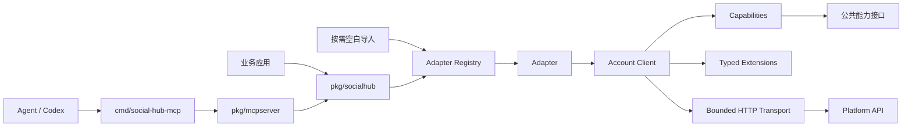

# social-hub 架构与维护蓝图

> 基线日期：2026-08-26（Asia/Shanghai）

本文描述仓库当前采用的架构、使用边界和维护规则。平台版本、认证、配额与审批条件变化频繁，具体接入信息以对应 `adapters/<name>/README.md` 和官方文档为准。

## 1. 项目边界

`social-hub` 统一多个平台 API 在接入层的重复问题：配置、账号隔离、能力发现、公共模型、凭据解析、HTTP 调用、错误分类，以及面向 Agent 的可控 MCP 暴露。

它明确不承担以下职责：

- 不把多个平台的写操作包装成原子事务。
- 不用一个巨型 Client 掩盖平台能力差异。
- 不把本地 fixture、源码存在或 HTTP 2xx 等同于真实业务完成。
- 不通过 Cookie、抓包或浏览器自动化模拟未公开 API。
- 不替调用方取得平台审核、商业合同、主体资质或用户授权。

一个 adapter 对应一个明确的 API 产品，而不只是一个品牌。内容、广告、转化、分析和消息产品应分别注册，避免混用版本、Token 和审批范围。

## 2. 当前快照

| 项目 | 状态 | 当前值 |
|---|:---:|---:|
| 公共核心包 | ✅ | `pkg/socialhub` |
| 共享 HTTP transport | ✅ | `internal/transport` |
| 素材与视频 typed extension | ✅ | `extensions/material`、`extensions/video` |
| 自部署 MCP 服务 | ✅ | `cmd/social-hub-mcp`、`pkg/mcpserver` |
| 已注册 API 产品 | ✅ | 179 |
| 适配器 README 全覆盖 | ❌ | 178/179 |
| 适配器本地测试文件全覆盖 | ❌ | 104/179 |
| 凭据化真实平台全覆盖 | ❌ | 当前不作此承诺 |
| 稳定公开版本 | ❌ | Alpha 开发阶段 |

`✅` 表示该项已具备，`❌` 表示覆盖尚不完整。适配器明细见[适配器目录](adapter-catalog.md)。

## 3. 总体架构



依赖方向为 `业务应用/MCP -> 公共契约 <- 平台适配器`。`pkg/socialhub` 与 `pkg/mcpserver` 都不直接导入具体平台；最终二进制通过 blank import 选择需要注册的适配器。

### 3.1 目录结构

```text
social-hub/
├── adapters/                  # 平台 API 产品及专用模型、流程和 README
├── assets/brand/              # Logo 与品牌资源
├── cmd/social-hub-mcp/        # 默认 MCP 入口及内置适配器清单
├── config/                    # SDK 配置示例
├── docs/                      # 架构、适配器目录和 MCP 部署文档
├── examples/mcp/              # MCP 配置示例
├── extensions/
│   ├── material/              # 临时/永久素材管理契约
│   └── video/                 # 异步视频上传与发布契约
├── internal/transport/        # 共享鉴权 HTTP transport
├── pkg/
│   ├── mcpserver/             # 可复用 MCP 服务层
│   └── socialhub/             # 公共模型、能力、配置、错误和注册表
└── skills/use-social-hub-mcp/ # Agent 操作规范
```

## 4. Adapter 生命周期

| 阶段 | 入口 | 责任 |
|---|---|---|
| 注册 | `socialhub.Register` | 将稳定注册名绑定到 factory；非法或重复注册直接 panic |
| 打开 | `socialhub.Open` | 查找 factory、创建实例并调用 `Init` |
| 初始化 | `Adapter.Init` | 校验公共配置和产品专用 settings，解析共享依赖 |
| 建立账号 Client | `Adapter.Client` | 按 `AccountID` 取得账号配置并解析运行时凭据 |
| 能力发现 | `Client.Capabilities` | 返回技术支持、审批状态、scope、原因和文档地址 |
| 调用 | 公共接口或 typed workflow | 执行账号级操作，不跨账号隐式共享状态 |
| 关闭 | `Client.Close` / `Adapter.Close` | 释放资源并终止该生命周期 |

注册名是公共契约，例如 `telegram/bot-api`、`facebook/page` 和 `tiktok/events-api-v2`。平台升级到不兼容版本时，应新增或明确迁移注册名，不能让同一名称静默改变语义。

## 5. 配置与账号隔离

配置版本固定为 `1`，由 `socialhub.LoadConfig` 严格解析 YAML 或 JSON。未知字段、缺失 adapter、空账号列表和重复账号 ID 会返回错误。

```yaml
version: 1
defaults:
  timeout: 15s
platforms:
  - adapter: telegram/bot-api
    product: bot-api
    accounts:
      - id: brand-bot
        access_token_ref: env://SOCIAL_HUB_TELEGRAM_BOT_TOKEN
        webhook:
          secret_ref: env://SOCIAL_HUB_TELEGRAM_WEBHOOK_SECRET
        settings:
          default_chat_id: "123456789"
```

配置约束：

- `AdapterConfig` 表示一个 API 产品，`AccountConfig` 表示该产品下的一个账号。
- 凭据字段只保存引用。默认 resolver 解析 `env://NAME`，其他 Secret 系统通过 `WithSecretResolver` 注入。
- `Settings map[string]any` 只作为配置传输层；适配器使用 `DecodeSettings` 严格解码为 typed struct。
- `ApprovalConfig` 记录账号类型和已授予 scope，但不替代平台实时权限判断。
- 不同 API 产品不得共享未经明确证明兼容的 Token namespace。

## 6. 公共能力

`Client` 公开六类可选能力。接口入口返回 `(能力, bool)`，详细状态由 `Capabilities()` 给出。

| Capability | 接口 | 公共契约 | 平台扩展 |
|---|---|:---:|:---:|
| `publish` | `Publisher` | ✅ | ✅ |
| `fetch` | `Fetcher` | ✅ | ✅ |
| `media` | `MediaUploader` | ✅ | ✅ |
| `react` | `Reactor` | ✅ | ✅ |
| `message` | `Messenger` | ✅ | ✅ |
| `webhook` | `WebhookHandler` | ✅ | ✅ |

`CapabilityState` 同时描述 `Supported`、`Approval`、`Scopes`、`Reason` 和 `DocURL`。调用方必须区分代码未实现、平台审批未获得和能力可用三种情况。

### 6.1 Typed extension

- `extensions/material.Manager` 表达临时或永久素材的上传、读取、列表和删除。
- `extensions/video.Workflow` 表达创建上传会话、上传、完成、发布、查询状态和中止。
- 广告、分析、转化或消息产品的特殊操作保留在对应适配器 package 中。

扩展通过 provider interface 发现。写操作不得依赖反射或无约束 `map[string]any`。

## 7. 数据模型

| 模型 | 核心语义 | 关键约束 |
|---|---|---|
| `User` | 平台用户或账号 | ID 使用 string，不假设跨应用全局唯一 |
| `Post` | 内容、媒体、关系和指标 | 区分缺失值与零值，不合并不同平台指标口径 |
| `Media` | 媒体对象与处理状态 | 支持异步处理和上传会话 |
| `Comment` | 评论或回复 | 通过父 ID 表达层级，树结构可由扩展补充 |
| `Message` | 会话消息 | 不把所有消息自动映射为公开内容 |
| `Event` | 已验签并归一化的回调事件 | 保留平台、账号和 typed payload 边界 |
| `Page[T]` | 一页结果与游标 | 不把 offset、cursor、page token 强制转成同一种分页 |

平台返回的 64 位或更大 ID 必须避免经过 `float64`。精确金额、收入、比例和统计值应使用适配器定义的安全表示。

## 8. 认证、Token 与 Secret

认证可能是 OAuth 2.0/PKCE、OAuth 1.0a、Bot Token、API Key、JWT、HMAC、JWS 或平台私有签名。共享 transport 提供 Bearer 与 query 参数鉴权基础，平台专用签名仍由适配器负责。

安全约束：

- Secret、授权码、session key 和原始 Token 不进入日志、错误字符串或 trace attribute。
- Token rotation 时原子替换最新 access/refresh token。
- Token 缓存键至少区分 platform、product、account、subject 和 scopes。
- Webhook Secret 与 API Token 分开配置和轮换。
- MCP tool 参数禁止接收平台凭据或 Secret 引用。
- 错误保留可操作分类，但不包含请求体、响应体或原始账号标识。

## 9. HTTP transport

`internal/transport` 提供共享的有界 HTTP 调用：

- base URL 必须包含 scheme 和 host，请求 path 必须是相对路径。
- 默认要求显式 HTTP client 和 TokenSource。
- 支持 request ID、idempotency key 和单次调用 timeout。
- 默认响应体上限为 8 MiB。
- 非 2xx 响应交给适配器 error decoder，缺省时按 HTTP 状态映射公共错误。
- transport 错误移除可能包含敏感查询参数的 URL 包装。
- 流式下载、大文件上传、WebSocket 或专用签名可以使用适配器 transport，但必须遵守同样的安全边界。

共享 transport 不是完整的全局重试或配额调度器。只有平台明确支持幂等、请求带幂等键或提交状态可查询时，写操作才可自动重试。

## 10. 错误契约

| ErrorCode | 默认处理 |
|---|---|
| `invalid_argument` | 修正调用参数，不重试 |
| `unauthenticated` | 更新或重新获取凭据 |
| `permission_denied` | 检查账号、角色和 scope |
| `approval_required` | 完成平台审核或商业授权 |
| `unsupported` | 改用其他能力或平台专用接口 |
| `not_found` | 检查资源 ID 与账号作用域 |
| `conflict` | 查询当前状态后决定是否重放 |
| `rate_limited` | 遵守 `RetryAfter` 或平台 reset 信息 |
| `temporarily_unavailable` | 仅在操作可安全重试时退避重试 |
| `platform_error` | 依据平台码、request ID 和适配器文档处理 |

`errors.Is/As` 用于公共分类。`ClassRetryable` 只表示策略可以考虑重试，不代表任意写操作都能安全重放。

## 11. Webhook

`WebhookHandler` 分为 `Verify` 和 `Decode` 两步。服务端必须先使用有界的原始请求体完成验签，再解析事件。

```text
读取原始 body -> 校验时间窗/签名 -> 解码 -> 幂等去重 -> 持久化 -> 快速响应 -> 异步消费
```

统一的是处理阶段，不是签名算法。日志默认不保存完整原始 Webhook；确需留存时应加密并设置最短保留期。MCP 不暴露 Webhook tool，真实 HTTP ingress 负责 headers 与 raw body。

## 12. MCP 边界

`pkg/mcpserver` 把配置中的 `{adapter, account_id}` 显式暴露为 target，并懒创建账号 Client。默认入口只编译 X、Facebook Page、Telegram、微信公众号、微博和抖音。

| 能力 | 默认状态 | 约束 |
|---|:---:|---|
| Target 与 capability discovery | ✅ | 每次调用显式指定 adapter 与 account ID |
| 读取工具 | ✅ | 仍可能因账号能力返回 unsupported |
| 新增型写操作 | ❌ | 通过 `--allow-write` 按 operation 启用 |
| 删除型写操作 | ❌ | 通过 `--allow-destructive` 单独启用 |
| 媒体文件上传 | ❌ | 避免任意文件读取、SSRF 和大体积 base64 |
| Webhook 处理 | ❌ | 必须由独立 HTTP ingress 完成 |
| 工具参数传入凭据 | ❌ | 凭据只从服务端配置解析 |

HTTP 模式默认绑定 loopback。非 loopback 监听强制 Bearer Token，并应置于 TLS reverse proxy 后。详见[MCP 自部署指南](mcp.md)。

## 13. 适配器维护契约

每个适配器至少维护：

- 唯一且稳定的 `adapterName`，以及匹配的 `Adapter.Name()`。
- `Metadata` 中的产品、API 版本、官方文档 URL 和 `VerifiedAt`。
- 公共配置与专用 settings 的严格校验。
- 明确的能力声明；审批受限能力包含 scope、原因和文档入口。
- 平台错误到公共错误的脱敏映射。
- README 中的认证、资质、能力、配额、限制和真实验证要求。
- 只在确有稳定交集时实现公共能力，其他操作保留 typed workflow。

`VerifiedAt` 表示合同或文档核对日期，不表示真实账号验证。真实结果应单独记录环境、账号类型、scope 和验证时间，且不得提交凭据或用户数据。

## 14. API 版本与文档

| 版本类型 | 例子 | 维护方式 |
|---|---|---|
| URL/产品版本 | Meta Graph、YouTube Data、Reddit Ads | 注册名或 metadata 固定主版本，升级前做兼容审查 |
| 日期/月份版本 | LinkedIn REST、部分广告平台 | 显式发送版本头，禁止随日期静默漂移 |
| 连续演进 | 微信、抖音、部分开放平台 | metadata 记录核对日期，按端点跟踪变化 |

优先使用官方 reference、changelog、Discovery/OpenAPI 和控制台合同。官方没有固定配额时，只记录动态策略和响应头，不猜测数字。白名单或商务合同内容只能作为账号级配置。

## 15. 运行与发布准则

| 准则 | 要求 |
|---|:---:|
| 配置中不出现明文 Secret | ✅ |
| 日志与错误经过脱敏 | ✅ |
| 调用前检查账号级能力 | ✅ |
| 写操作默认假设可安全重试 | ❌ |
| 把 HTTP 2xx 等同于业务完成 | ❌ |
| 把本地 fixture 等同于真实平台验证 | ❌ |
| 未经授权抓取或模拟私有 API | ❌ |

发布稳定版本前仍需确定公开 module path、兼容与弃用政策、真实账号验证分级，并对安全、平台条款、隐私和数据保留做独立审查。

## 16. 维护优先级

1. 优先修正注册名、认证、签名、精度或数据泄露问题。
2. 补齐 capability 与 README，让调用方在执行前判断真实边界。
3. 统一分页、错误、响应上限和异步状态语义。
4. 最后扩大平台与端点覆盖；新增数量不应优先于现有合同的可验证性。

适配器清单从源码注册名维护。根 README 只保留入口和汇总，避免再次膨胀成难以核对的单表。
